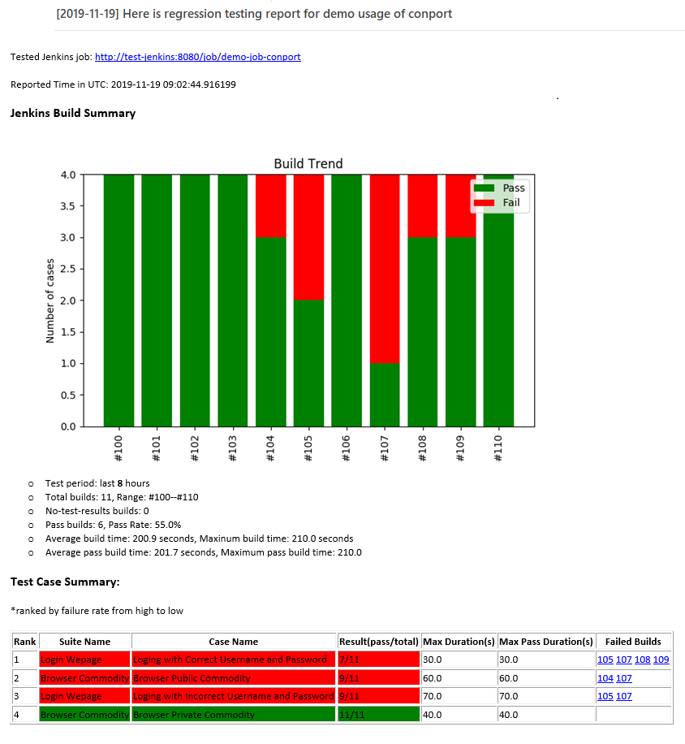

<p align="center">
	
</p>

<p align="center">
	
	<a href="https://travis-ci.org/slxiao/conport">
		
	</a>
	<a href="https://www.python.org/download/releases/2.7.14/">
		
	</a>
	<a href="https://coveralls.io/github/slxiao/conport?branch=master">
		
	</a>
	<a href="https://pepy.tech/project/conport">
		
	</a>
</p>

**conport** is an Python tool for generating continuous regression testing reports. It supports both HTML report and email report. In each report, testing build trend, testing build metrics and test case summary are demonstrated. Check the [demo](#demo) as an example.
# How to install
Use pip to install:
```shell
pip install conport
```
or you can clone the repo, and inside the directory, run:
```shell
python setup.py develop
```
> note: when install conport, all denpendent libs specified in [requirements.txt](./requirements.txt) will be automatically installed. Due to the requirement of dependency `matplotlib`, you may need to install Linux library `python-tk` if necessary. In ubuntu, you can run command `apt install python-tk` to install it.

# How to use
After install conport successfully, shell command `conport` will be avaiable.

Check version of `conport`:
```shell
conport --version
```
Get help of `conport`:
```shell
comport -h
```
Available arguments can be found from help command output:
```shell
usage: conport [-h] [--job_url JOB_URL] [--report_title REPORT_TITLE]
               [--past_hours PAST_HOURS] [--send_email SEND_EMAIL]
               [--mail_host MAIL_HOST] [--mail_user MAIL_USER]
               [--mail_pwd MAIL_PWD] [--sender SENDER] [--receivers RECEIVERS]
               [--receivers_cc RECEIVERS_CC] [--pure_html PURE_HTML]
               [--version]

optional arguments:
  -h, --help            show this help message and exit
  --job_url JOB_URL     Jenkins job url
  --report_title REPORT_TITLE
                        continuous testing report title
  --past_hours PAST_HOURS
                        number of past hours to be monitored
  --send_email SEND_EMAIL
                        whether to send email or not
  --mail_host MAIL_HOST
                        email host
  --mail_user MAIL_USER
                        email user
  --mail_pwd MAIL_PWD   email password
  --sender SENDER       email sender
  --receivers RECEIVERS
                        email receivers, format is receiver1, receiver2, ...
  --receivers_cc RECEIVERS_CC
                        email receivers cc, format is receivercc1,
                        receivercc2, ...
  --pure_html PURE_HTML
                        pure html or not
  --version             print version
```
The arguments, if not speficied, will be fetched from the [default configuration file](./conport/cfg.ini). Anyway, for your specific configuration, these arguments needs to be given.
> note: parameter `pure_html` is needed because email cannot support HTML5 figure. In that case, `conport` create figure by using `matplotlib` and then embed that figure into email message with `email.MIMEImage`. 
# demo
The following demo picture is created from command:
```shell
conport --job_url http://test-jenkins:8080/job/demo-job-conport --past_hours 8 --report_title "Here is regression testing report for demo usage of conport" --pure_html false --send_email true
```
You can obtain some key information from the picture:
- Tetsing build trend
- Testing build metrics
- Test case summary, with a focus on failed cases statistics


# How to develop
First install `tox` with:
```shell
pip install tox
```
Run UT and coverage:
```shell
python -m pytest -vv -s --cov=conport --cov-report term --cov-report html
```
Run tox:
```shell
tox -e test
```
Local install and test:
```shell
python setup.py develop
```
# Lisense
MIT
# Maintenance
This tool is developed by [slxiao](https://github.com/slxiao). You are welcome to raise any [issues](https://github.com/slxiao/conport/issues) about the tool.
